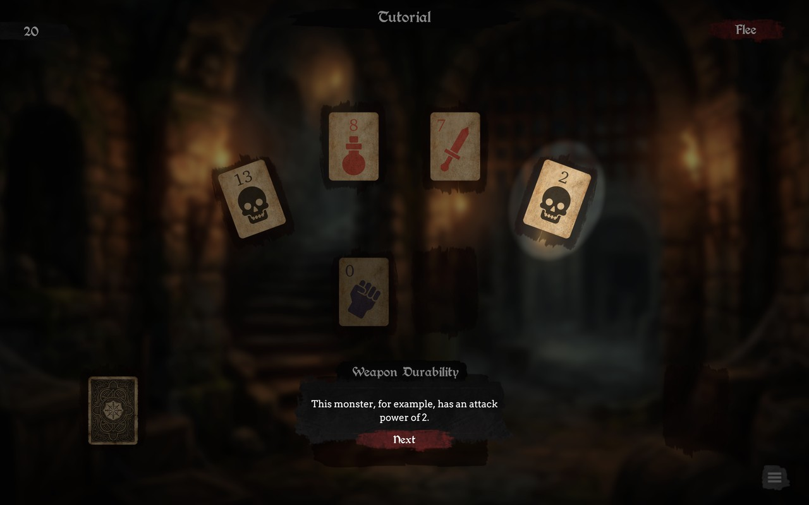

# Scene Highlighter

[](https://unity.com)
[](LICENSE)

A full-screen overlay that darkens the screen and cuts soft-edged oval highlights over specific scene or UI targets. Useful for tutorials, guided walkthroughs, and drawing attention to a specific element.

Render pipeline agnostic: the shader renders through uGUI's `CanvasRenderer`, a rendering path separate from the SRP graphics pipeline, so both the shader and the provided `HighlighterMaterial` work unmodified under Built-in, URP, or HDRP — no per-pipeline variants needed.



Everything lives under the `MoodyLib.SceneHighlighter` namespace.

## Contents
- **HighlightableArea.cs**: A `MonoBehaviour` describing a highlightable rectangular area (offset/size, same shape as `BoxCollider2D`'s API) in either Scene space (projected through a `Camera`) or UI space (normalized against screen dimensions). Recomputes its bounds every frame so a moving/animating target stays tracked — delegates to `Quad.FromWorldSpace`/`Quad.FromScreenSpace` internally.
- **Quad.cs**: A generic 4-corner perimeter-ordered shape describing a highlight's bounds in normalized viewport space, plus the factory methods that build one: `FromWorldSpace` (Scene, camera-projected, rotation-aware on all 3 axes) and `FromScreenSpace` (UI, real pixel coordinates).
- **HighlightOverlay.cs**: A `MonoBehaviour` (paired with a full-screen UI `Image`) that draws the darkening overlay and cuts holes at the given `Quad`s. Implements `ICanvasRaycastFilter` so clicks pass through the holes unless explicitly blocked.
- **HighlightOverlay.shader**: The shader that renders the overlay, computing an ellipse inscribed in each highlight quad (supporting rotation) with a configurable feathered gradient at the boundary.
- **HighlighterMaterial.mat**: The material using the shader above. Its `_Color`/`_FeatherAmount` properties are the actual source of truth for the overlay's color and feather width — edit the material directly, not the component.
- **HighlightOverlay.prefab**: A ready-to-use full-screen `Image` with `HighlightOverlay` attached and `HighlighterMaterial` assigned. Its `Image` starts disabled; `HighlightOverlay` re-enables it in `Awake`.

## Install via Git URL

1. In Unity, open **Window > Package Manager**.
2. Click the **+** button in the top-left corner.
3. Select **"Add package from Git URL…"**.
4. Paste this URL and click **Add**:
   ```text
   https://github.com/fapoli/MoodyLib.SceneHighlighter.git
   ```

## How to use
1. Drop the `HighlightOverlay` prefab into your top canvas (or build your own full-screen `Image` with a `HighlightOverlay` component and the `HighlighterMaterial` assigned).
2. Add a `HighlightableArea` component to anything you want to be able to highlight, and configure its `offset`/`size` and `Mode` (Scene or UI).
3. Call `HighlightOverlay.SetHighlight(highlightableArea)` (or `SetHighlights` for multiple at once) whenever you want to show the overlay, and `HighlightOverlay.Clear()` to hide it. Both are static — no reference to the component instance needed.

If you need a highlight not tied to a persistent `HighlightableArea` (e.g. a one-off region computed on the fly), build a `Quad` directly via `Quad.FromWorldSpace(...)` (Scene) or `Quad.FromScreenSpace(...)` (UI) and pass it to `HighlightOverlay.SetHighlight(myQuad)`.
